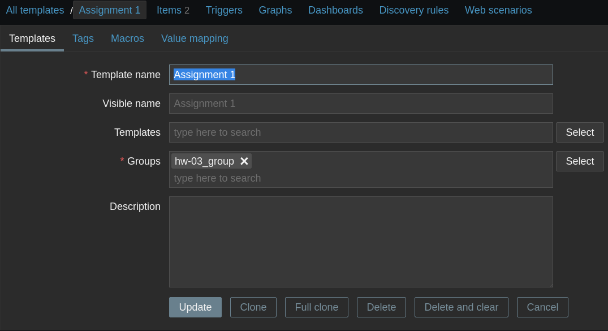
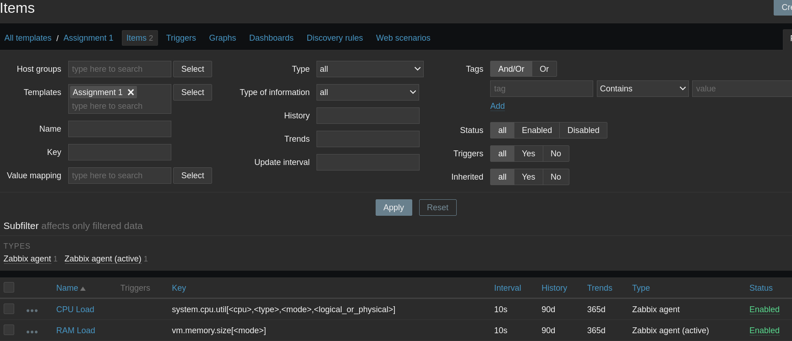
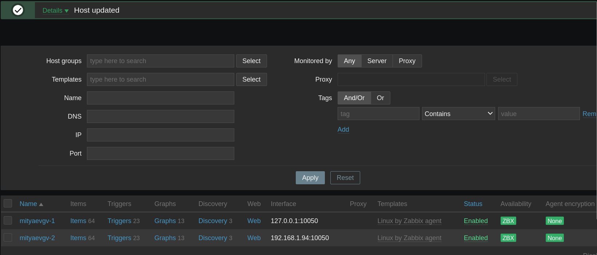

# hw-03_mon_zabbix2
HW-03_Система мониторинга Zabbix. Часть 2

# Домашнее задание к занятию «Система мониторинга Zabbix. Часть 2»

### Цели задания
1. Научитьcя создавать свои шаблоны в Zabbix, добавлять в Zabbix хосты и связывать шаблон с хостами.
2. Научиться составлять кастомный дашборд.
3. Научиться создавать UserParameter на Bash.
4. Научиться создавать Python-скрип, добавляться в него UserParameter и прикреплять к шаблону.
5. Научиться создавать Vagrant-скрипты для Zabbix Agent.

### Задание 1

Создайте свой шаблон, в котором будут элементы данных, мониторящие загрузку CPU и RAM хоста.

#### Процесс выполнения

2. Создал новый шаблон **Assignment 1**.
3. Создал item **CPU Load** (system.cpu.util).
4. Создал item **RAM Load** (vm.memory.size).

<kbd></kbd>

<kbd></kbd>

---

### Задание 2

Добавьте в Zabbix два хоста и задайте им имена <фамилия и инициалы-1> и <фамилия и инициалы-2>. Например: ivanovii-1 и ivanovii-2.

#### Процесс выполнения

5. Прикрепил к хостам **mityaevgv-1** и **mityaevgv-2** шаблон **Linux by Zabbix agent**:

<kbd></kbd>

### Задание 4

Создайте свой кастомный дашборд.

#### Процесс выполнения
2. Создал новый дэшборд **Assignment 4**.
3. Разместил на дэшборде 4 графика: **CPU Utilisation**, **Available RAM**, **Load Average (15m)** и **Disk Space (in use)**.

<kbd></kbd>

<kbd></kbd>

<kbd></kbd>

---

